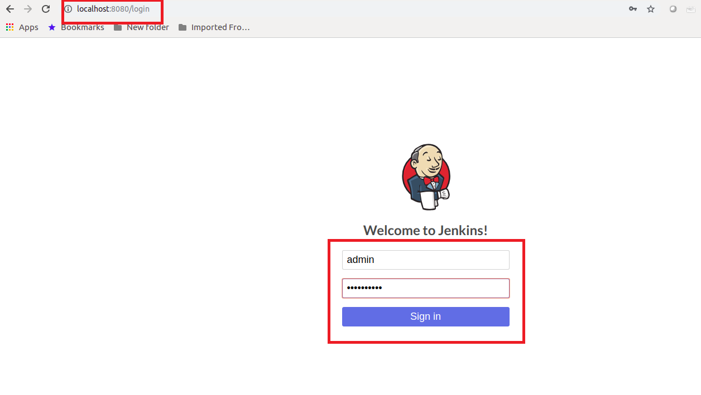
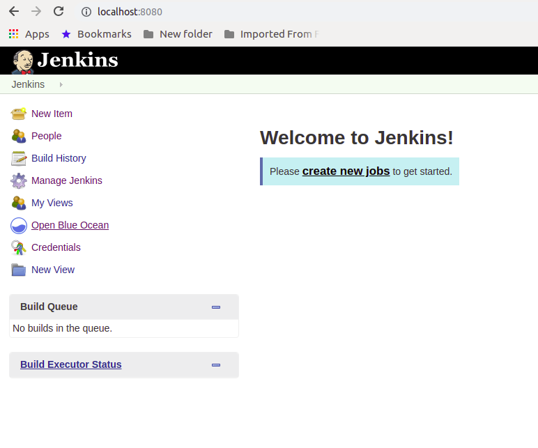
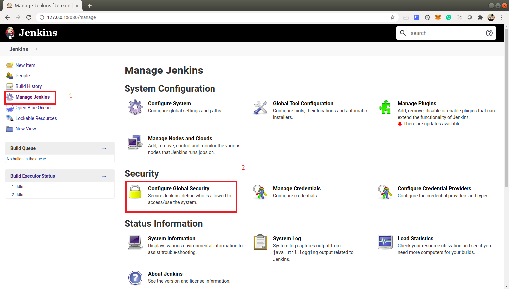
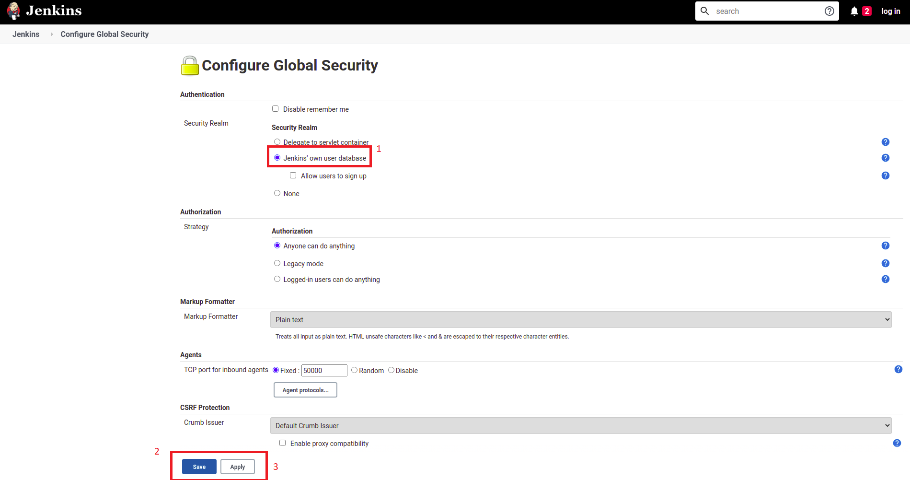
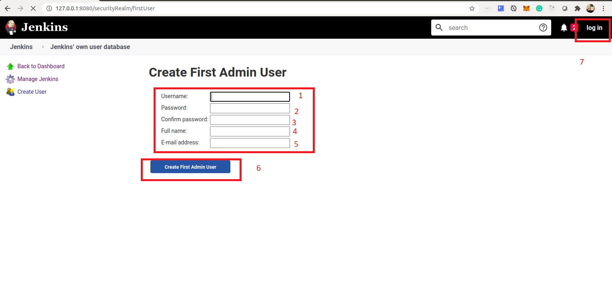

# DevOps: Deploying Microservices to OKE with Jenkins Pipelines (CI/CD) #

**Step 2** - Assumption [Initial Setup](jenkins.pipelines.OKE2) is complete.
# Step 3 - Create Jenkins Instance in your kubernetes cluster #
In this lab, you are going to install, set up and configure Jenkins in your kubernetes clusters. To do this, we are going to use **Helm chats**. [Helm](https://helm.sh/) helps you manage your kubernetes applications.

## Install Jenkins via Helm

1. Install Helm. Instruction to install helm are [here](https://helm.sh/docs/using_helm/#installing-helm). Using [chocolatey](https://chocolatey.org/) is recommended
2. Once Helm is installed, check if the version of helm that's running on you machine is the same as on your kubernetes cluster. To do this execute the following command:
```sh
helm version
```

Expected output:

```sh
version.BuildInfo{Version:"v3.3.0", GitCommit:"8a4aeec08d67a7b84472007529e8097ec3742105", GitTreeState:"dirty", GoVersion:"go1.14.7"}
```


If you check the version again, they should be the same now.

3. Now that helm all setup you can now start Jenkins setup. First, we are going to clone a git repository on to your machine. 

```sh
mkdir oracle_projects
cd oracle_projects
git clone https://github.com/allenkubai/kubernetes.git
```

Once you have cloned the project, change into the project directory:

```sh
cd kubernetes
```
4. The next step before we install Jenkins, we need to create a persistance storage volume for jenkins in the kubernetes cluster. This is where jenkins will store it's data. To do this, use the deployment file already provided for you in this project: [https://github.com/allenkubai/kubernetes/blob/master/oracle/oke/helm/jenkins/jenkins-volume-claim.yaml](https://github.com/allenkubai/kubernetes/blob/master/oracle/oke/helm/jenkins/jenkins-volume-claim.yaml)

To use this deployment file to create a volume claim execute the following command:

```sh
kubectl create -f ./oracle/oke/helm/jenkins/jenkins-volume-claim.yaml
```
Output:
```sh
persistentvolumeclaim/jenkinsclaim created
```

To check if the persistent volume claim has been create:

```sh
kubectl get pvc
```
Output:
```sh
NAME           STATUS    VOLUME    CAPACITY   ACCESS MODES   STORAGECLASS   AGE
jenkinsclaim   Bound     ocid1.**   100Gi      RWO            oci            66s
```
5. We can install Jenkins now using a helm chart. To do this, we will install jenkins with a values descriptor file, which define which plugins and their version to installs. You can have a look at it here [https://github.com/allenkubai/kubernetes/blob/master/oracle/oke/helm/jenkins/values.yaml](https://github.com/allenkubai/kubernetes/blob/master/oracle/oke/helm/jenkins/values.yaml).

execute the following command:

```sh
helm install cd-jenkins stable/jenkins -f ./oracle/oke/helm/jenkins/values.yaml --wait
```

If you do not see the success message, instead seeing an error like
```sh
Error: failed to download "stable/jenkins" (hint: running `helm repo update` may help)
```
Please run the following commands and retry. This will update your helm repository
```sh
helm repo add stable https://kubernetes-charts.storage.googleapis.com/
helm repo update
```

Once it's done installing you will see the output below with instructions on how to get jenkins admin password and to get access to jenkin via port forwarding _(if yours is different, use the one in your output)_:

```sh
cd-jenkins-84695c79d8-r4vmh  1/1    Running  0         2m

1. Get your 'admin' user password by running:
  printf $(kubectl get secret --namespace default cd-jenkins -o jsonpath="{.data.jenkins-admin-password}" | base64 --decode);echo
2. Get the Jenkins URL to visit by running these commands in the same shell:
  export JENKINS_POD=$(kubectl get pods --namespace default -l "component=cd-jenkins-master" -o jsonpath="{.items[0].metadata.name}")
  echo http://127.0.0.1:8080
  kubectl port-forward $ JENKINS_POD 8080:8080
```

Let's execute the first command to get our admin password:

```sh
printf $(kubectl get secret --namespace default cd-jenkins -o jsonpath="{.data.jenkins-admin-password}" | base64 --decode);echo

ZYV1o****
```
Now you have our password **ZYV1o****** copy it somewhere:

## Access Jenkins
Next let setup our port forwarding for us to get access to Jenkin interface

```sh
export JENKINS_POD=$(kubectl get pods --namespace default -l "component=cd-jenkins-master" -o jsonpath="{.items[0].metadata.name}")

kubectl port-forward $JENKINS_POD 8080:8080
```
**Please note that you can change the local port if you have something else running on port 8080 on you local machine**

**Running the `kubectl port-forward` command will keep your terminal busy. Pressing to Ctrl + C will terminate port forwarding**


Now you can got your browser and enter [http://localhost:8080/](http://localhost:8080/)

Here is the Jenkins login page:



Here is the initial dashboard once you login. 



**PLEASE NOTE: that if your Jenkins instance logs you in AUTOMATICALLY then you have to configure security. WITHOUT security enabled on Jenkins, you won't be able to setup your pipelines.**

**Jenkins Security**

1. Click in Manage Jenkins > Configure Global Security



2. Go to Security Realm and select 'Jenkins' Own user database'. Then 'Save' and 'Apply'



3. The will take you to the 'Create First Admin User' page. Fill in the details and click 'Create First Admin User'. Then top right click 'log in'



Note the login is similar to steps shown above. 
**Please note that you might have some updates to make for some of the plugins that were installed using the values descriptor file. They  might be out of date depending on when you do this lab** 

---
[Go back to Jenkins Pipelines Workshop Home page](README.md)

[Previous](jenkins.pipelines.OKE2.md)

[Next](jenkins.pipelines.OKE4.md)