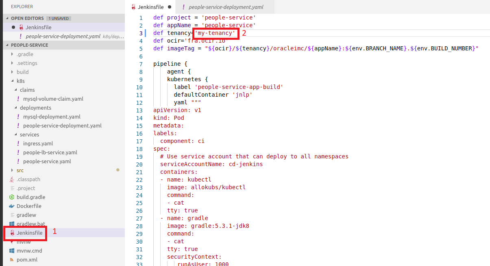
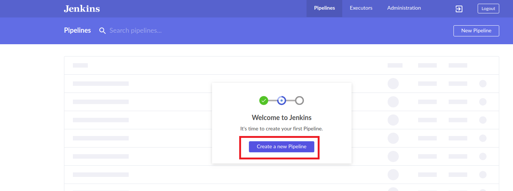
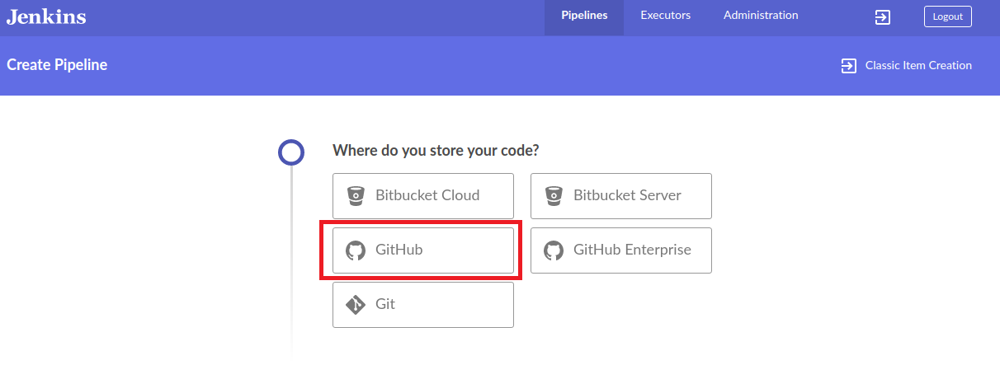
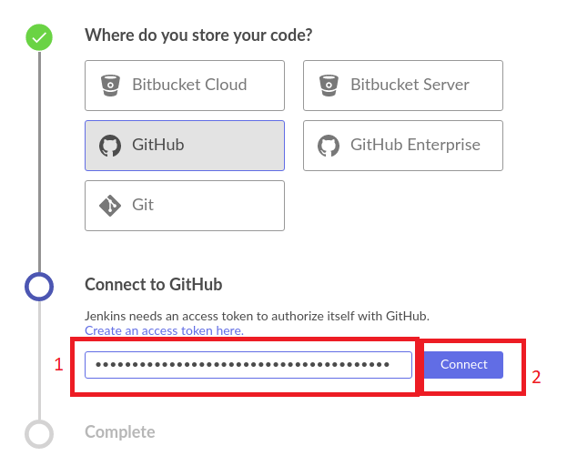
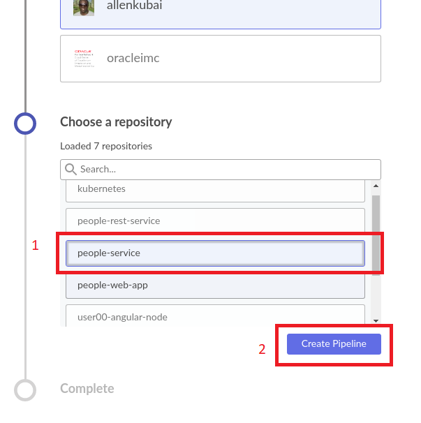
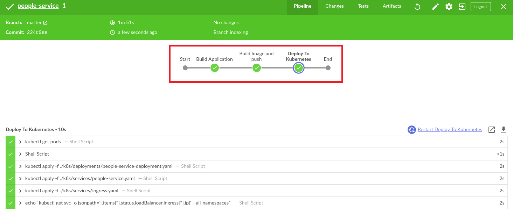
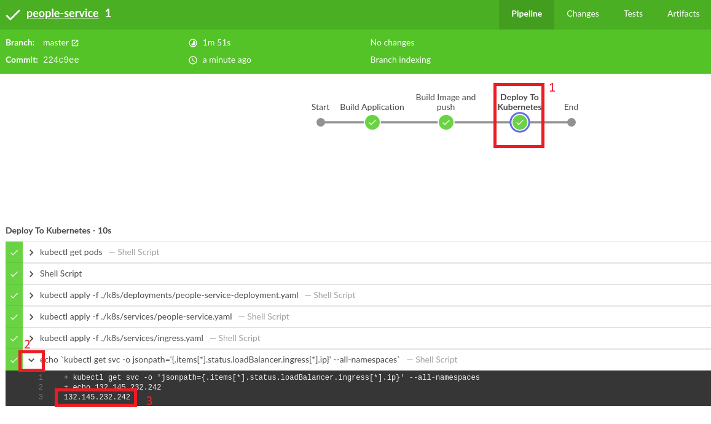
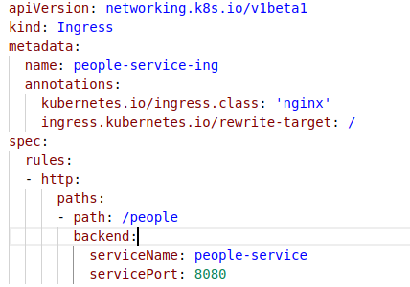

# DevOps: Deploying Microservices to OKE with Jenkins Pipelines (CI/CD) #

# Prerequisites
+ Make sure you have completed the Initail Setup  [Step 3](jenkins.pipelines.OKE2.md).
+ Make sure Jenkins is running.

# Step 7 - Deploy the people-service backend API using Jenkins Pipelines #
In this lab, we are going to deploy our backend API microservice. This is a SpringBoot Application exposing a rest endpoint.

+ Create Docker Registry Secret
+ Update the tenancy and OCIR url in the JenkinsFile
+ Create Jenkins Pipeline using JenkinsFile
+ Verify the endpoint


### Create Docker Registry Secret in the Cluster ###

For the jenkins pipeline to be able to pull images from OCIR, we have to added our Auth Token to our cluster as a secret. 

+ Replace {tenancy}/{username} and {Auth Token}

**Please note if you are in another region apart from eu-frankfurt please also change the --docker-server**

```
kubectl create secret docker-registry ocirsecret --docker-username='{tenancy}/{username}' --docker-password='{Auth Token}' --docker-server=fra.ocir.io --docker-email='api.user@acme.com'
```

Output:

```
secret/ocirsecret created
```

### Update the tenancy and OCIR url in the JenkinsFile ###

Before you can create your pipelines, you need to update the tenancy and ocir url on the JenkinFile and commit to your git repository.

1. Open the JenkinFile. The file is located in the root directory of your project. 



**PLEASE NOTE: that if the cluster in a different region other than eu-frankfurt then you will need to change the ocir url on line 4.** 

2. **Commit and push this file to your git repository before you continue with the next step.** 

### Create Jenkins Pipeline using JenkinsFile ###

1. Login to the Jenkins Instances.
2. On the jenkins dashboard click on *Open Blue Ocean*. 


3. On the Blue Ocean screen click on *Create a new Pipeline*.



4. Select Github



5. For Jenkins to connet to your github account, you will need to provided you Github access token. Click *Connect*



6. Select the the organization which your repository belongs to


7. Now choose your repository. In this case ***people-service***. Click *Create Pipeline*



You pipeline will started executing as shown below. Click on *STATUS* to see the execution progress.


Wait for the execution to complete. 


Once complete, you will see that the pipeline went through four steps

+ Start
+ Build Application
+ Build Image and Push image
+ Deploy to Kubernetes



To confirm that people-service is up, you get check the pods:

```
kubectl get pods
```
Output:
```
NAME                              READY     STATUS    RESTARTS   AGE
cd-jenkins-7cdb6d66b4-l9z9d       1/1       Running   0          5h5m
mysql-69cfc89647-fjk7c            1/1       Running   0          4h42m
people-service-57f5f77574-wjdhg   1/1       Running   0          5m8s
```

Also check the service was created

```
kubectl get svc
```
Output:
```
NAME               TYPE        CLUSTER-IP      EXTERNAL-IP   PORT(S)     AGE
cd-jenkins         ClusterIP   10.96.187.120   <none>        8080/TCP    6h18m
cd-jenkins-agent   ClusterIP   10.96.136.94    <none>        50000/TCP   6h18m
kubernetes         ClusterIP   10.96.0.1       <none>        443/TCP     6h37m
mysql              ClusterIP   10.96.217.28    <none>        3306/TCP    5h54m
people-service     ClusterIP   10.96.65.158    <none>        8080/TCP    6m
```
### Verify the endpoint ###

Let's get the public ip of our deploy service. Go to you pipeline execution and select *Deploy To Kubernetes*, then select the last output and expand it to get the public ip.



The Backend API is using a shared load balance, you need to check the ingress.yml file to confirm it's url path. The ingress file is located under k8s/services/ingress.yaml under the people-service. In my case it's *'/people'*. As shown in the image below.



Therefore my url will be ***http://< ip  >/< restendpoint >***. Input this a browser of you choice. 


As you can see you backend api is now up and running!!

Up next, deploying your frontend

---
[Go back to Jenkins Pipelines Workshop Home page](README.md)

[Previous](jenkins.pipelines.OKE6.md)

[Next](jenkins.pipelines.OKE8.md)
