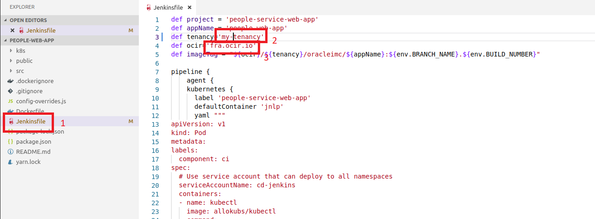
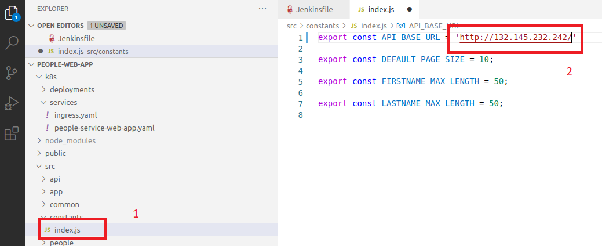
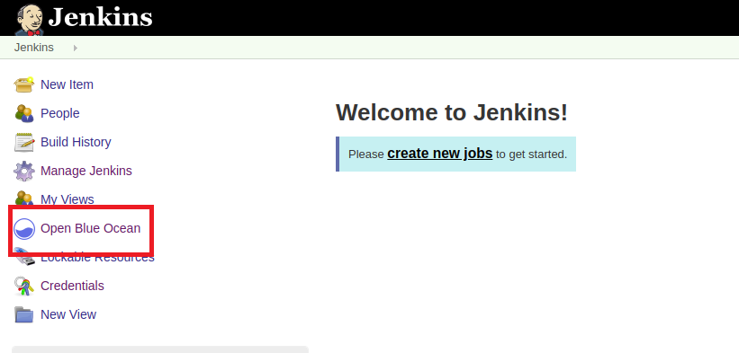
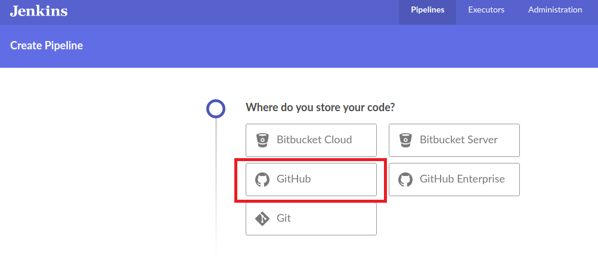
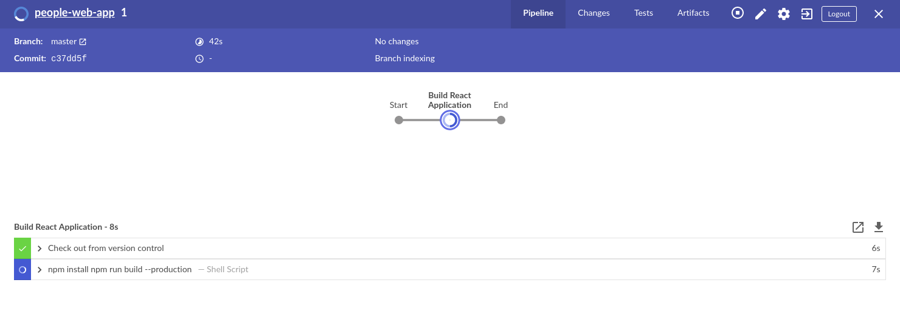
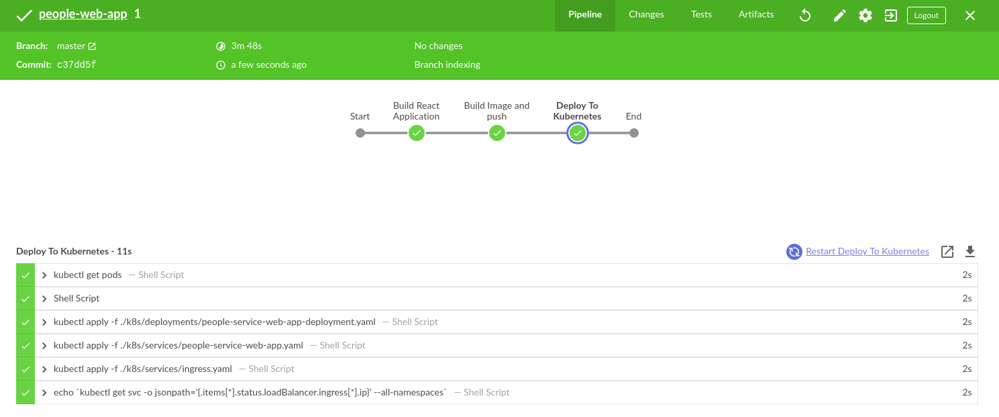
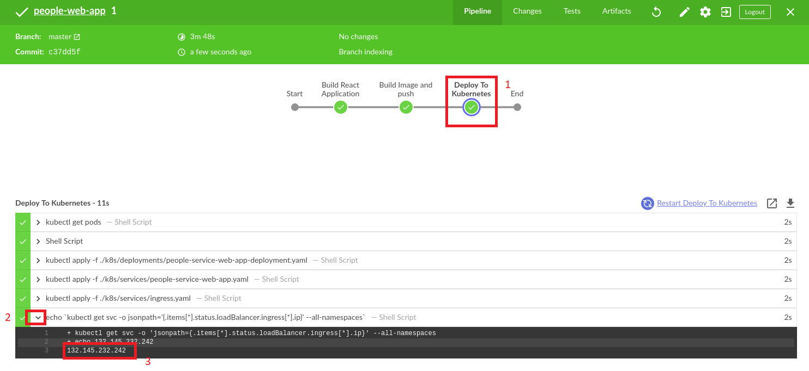

# DevOps: Deploying Microservices to OKE with Jenkins Pipelines (CI/CD) #

# Prerequisites
+ Make sure you have completed the Initail Setup  [Step 7](jenkins.pipelines.OKE7.md).
+ Make sure Jenkins is running.

# Step 8 - Deploy the people-web-app frontend using Jenkins Pipelines #
In this lab, we are going to deploy our backend API microservice. This is a SpringBoot Application exposing a rest endpoint.

+ Update the tenancy, OCIR url and API endpoint in the JenkinsFile
+ Create Jenkins Pipeline using JenkinsFile
+ Connecting to the web application 

### Update the tenancy, OCIR url and API endpoint in the JenkinsFile ###

Before you can create your pipelines, you need to update the tenancy and ocir url on the JenkinFile and commit to your git repository.

1. Open the JenkinFile. The file is located in the root directory of your project. 



**PLEASE NOTE: that if the cluster in a different region other than eu-frankfurt then you will need to change the ocir url on line 4.** 

2. Update the API rest endpoint in the people-web-app with the api endpoint generate from the previous pipeline. *Open* the file src/constants/index.js 



3. **Commit and push these two files to your git repository before you continue with the next step.** 

### Create Jenkins Pipeline using JenkinsFile ###

1. Login to the Jenkins Instances.
2. On the jenkins dashboard click on *Open Blue Ocean*. 



3. On the Blue Ocean screen click on *Pipelines > New Pipeline*.


4. Select Github



5. For Jenkins to connect to your github account, you will need to provided you Github access token. But in this case since you had already provided this in the previous pipeline therefore this step is *skipped*


6. Select the the organization which your repository belongs to


7. Now choose your repository. In this case ***people-web-app***. Click *Create Pipeline*


You pipeline will started executing as shown below. Click on *STATUS* to see the execution progress.


Wait for the execution to complete. 



Once complete, you will see that the pipeline went through four steps

+ Start
+ Build Application
+ Build Image and Push image
+ Deploy to Kubernetes



To confirm that people-web-app is up, you get check the pods:

```
kubectl get pods
```
Output:

```
NAME                                 READY     STATUS    RESTARTS   AGE
cd-jenkins-7cdb6d66b4-l9z9d          1/1       Running   0          5h21m
mysql-69cfc89647-fjk7c               1/1       Running   0          4h58m
people-service-57f5f77574-wjdhg      1/1       Running   0          21m
people-service-web-app-f3rts-z54qj   4/4       Running   0          6m2s
people-web-app-86468bb8dc-9c6qx      1/1       Running   0          2m55s

```

### Connecting to the web application ###

Let's get the public ip of our deploy service. Go to you pipeline execution and select *Deploy To Kubernetes*, then select the last output and expand it to get the public ip.



The Backend API is using a shared load balance, you need to check the ingress.yml file to confirm it's url path. The ingress file is located under k8s/services/ingress.yaml under the people-web-app. In my case it's *'/'*. As shown in the image below.


Therefore my url will be ***http://< ip  >/***. Input this a browser of you choice. 


To add some data click on the icon. The add your first and last name and click *Create Person*


After clicking *Create Person* the application goes back to the main page and the person is listed there.


We can also check the REST endpoint to see if how the API presents the data.


As you can see your application is now up and running!!